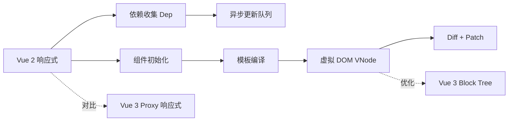
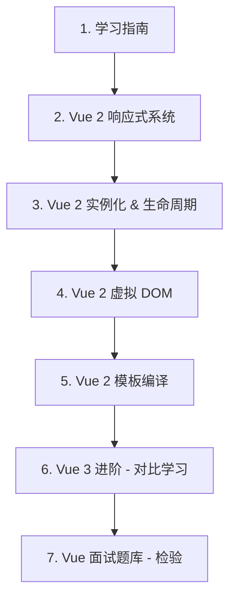

## 源码版本

| 项目 | 版本 | 说明 |
|:--|:--|:--|
| Vue 2 | 2.7.16 | Vue 2 最后一个大版本，源码仓库位于 `vue2-source/` |
| Vue 3 | 3.4.21 | 新一代响应式架构，源码仓库位于 `vue3-source/` |

## 学习路线图

```mermaid
graph LR
    A[Vue 2 响应式] --> B[依赖收集 Dep]
    B --> C[异步更新队列]
    A --> D[组件初始化]
    D --> E[模板编译]
    E --> F[虚拟 DOM VNode]
    F --> G[Diff + Patch]
    A -.对比.-> H[Vue 3 Proxy 响应式]
    F -.优化.-> I[Vue 3 Block Tree]
```

## 推荐学习顺序

```mermaid
graph TD
    A[1. 学习指南] --> B[2. Vue 2 响应式系统]
    B --> C[3. Vue 2 实例化 & 生命周期]
    C --> D[4. Vue 2 虚拟 DOM]
    D --> E[5. Vue 2 模板编译]
    E --> F[6. Vue 3 进阶 - 对比学习]
    F --> G[7. Vue 面试题库 - 检验]
```